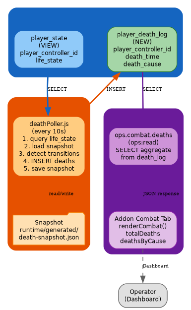
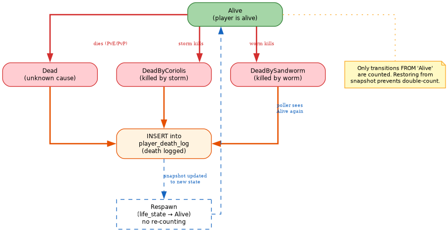
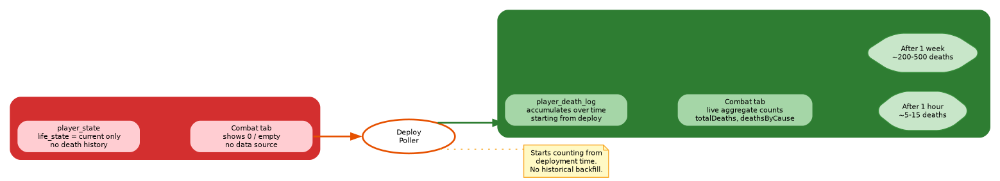

# RFC: Combat Death Tracking via Local Poller

**RFC ID**: RFC-DOO-0002
**Status**: Draft
**Date**: 2026-07-07
**Authors**: DarkDante (@yacketrj)
**Target**: `dune-awakening-selfhost-docker` core

---

## Abstract

The `dune` database does not store cumulative combat death data. The `event_log` table (31 partitions) and `game_events` table record building/interaction events but contain zero combat-related rows. Funcom's backend (FLS) aggregates per-server death/kill metrics server-side but exposes no public query API. This RFC proposes a lightweight local poller that snapshots `player_state.life_state` transitions to populate a `player_death_log` table, enabling the addon's Combat tab via the `ops.combat.deaths` bridge action.

---

## 1. Motivation

### 1.1 Current State

| Source | Status | Reason |
|---|---|---|
| `event_log` (31 partitions) | 0 rows | Only logs economy transactions (`solaris` category) |
| `game_events` | 3 rows | Building/totem events only (event_type 10, 13, 19) — no combat events |
| `actor_audit` | 27 rows | Building actor lifecycle (Controller, Pawn, BP_TotemSmall_C, etc.) |
| `player_state.life_state` | Current-state only | Shows `Alive`/`Dead`/`DeadByCoriolis`/`DeadBySandworm` — no history |
| Funcom FLS | Backend-only | Director pushes data to FLS but no query endpoint exposed |

### 1.2 Analysis

The game engine tracks death causes natively — the `playerlifestate` enum includes `Dead`, `DeadByCoriolis`, and `DeadBySandworm`. The `cheat_type_enum` includes `player_died` as a cheat-detection event. However, none of these are persisted as cumulative counters locally. The data is sent to Funcom's backend where they aggregate it for their public metrics visual. There is no API to retrieve this data back.

### 1.3 Goals

1. Track cumulative player deaths locally without relying on Funcom's backend
2. Expose death data through a permissioned bridge action (`ops.combat.deaths`)
3. Enable the addon's Combat tab to display real death statistics
4. Keep the implementation lightweight — in-process poller, no new containers

---

## 2. Terminology

| Term | Definition |
|---|---|
| `player_state` | VIEW over `encrypted_player_state` with decrypted columns — the authoritative source for player lifecycle |
| `life_state` | Enum: `Alive`, `Dead`, `DeadByCoriolis`, `DeadBySandworm` — current player state |
| `player_death_log` | Proposed new table tracking death events as INSERT-only append log |
| Death poller | In-process Node.js module running via `setInterval` inside the Console API server |
| Snapshot | JSON file at `runtime/generated/death-snapshot.json` storing the last known life_state per player |
| Transition detection | The poller compares current life_state against the snapshot to detect changes FROM 'Alive' |

---

## 3. Proposed Architecture

### 3.1 Data Flow



```
player_state (VIEW)
    │
    │  every 10 seconds: SELECT player_controller_id, life_state
    ▼
deathPoller.js
    │
    │  compare with runtime/generated/death-snapshot.json
    │  detect transitions: Alive → Dead/DeadByCoriolis/DeadBySandworm
    ▼
player_death_log (INSERT)
    │
    │  SELECT aggregate counts via addonOpsCombatDeaths()
    ▼
ops.combat.deaths bridge action
    │
    │  JSON response: { totalDeaths, deathsByCause, ... }
    ▼
Addon Combat tab (renderCombat)
```

### 3.2 State Machine



The poller is idempotent — it only logs transitions FROM 'Alive' to any Dead state. When a player respawns (life_state returns to 'Alive'), no re-counting occurs. If the poller restarts mid-session, it loads the last snapshot and only logs new transitions.

### 3.3 Schema

```sql
CREATE TABLE IF NOT EXISTS dune.player_death_log (
  id bigint GENERATED ALWAYS AS IDENTITY,
  player_controller_id bigint NOT NULL,
  death_time timestamptz NOT NULL DEFAULT now(),
  death_cause text NOT NULL,              -- life_state::text value
  PRIMARY KEY (id)
);
CREATE INDEX IF NOT EXISTS idx_player_death_log_time
  ON dune.player_death_log (death_time);
CREATE INDEX IF NOT EXISTS idx_player_death_log_player
  ON dune.player_death_log (player_controller_id);
```

The `death_cause` column stores the raw `life_state::text` value at the time of death:
- `Dead` — unknown/standard death (PvP, PvE, environment)
- `DeadByCoriolis` — killed by Coriolis storm
- `DeadBySandworm` — killed by sandworm

No PII is stored — only `player_controller_id` (internal game identifier), no character names, account IDs, or Funcom identifiers.

### 3.4 Poller Logic

```
On each tick (10s interval):
  1. SELECT player_controller_id, life_state::text FROM dune.player_state
  2. Load previous snapshot from runtime/generated/death-snapshot.json
  3. For each player where previous.life_state = 'Alive' AND current.life_state LIKE 'Dead%':
       INSERT INTO dune.player_death_log (player_controller_id, death_cause)
  4. Save current state as new snapshot
  5. Suppress transient DB errors per existing runBackgroundTick pattern
```

---

## 4. Component Specifications

### 4.1 deathPoller.js

New module at `console/api/src/deathPoller.js`, following the exact pattern of `memoryBalancer.js`:

```js
// State
let snapshot = new Map();     // player_controller_id → life_state
let running = false;
const INTERVAL_MS = 10000;
const SNAPSHOT_FILE = "runtime/generated/death-snapshot.json";

// Called from server.js at startup
export function initDeathPoller(db, repoRoot) {
  ensureTable(db);
  loadSnapshot(repoRoot);
  setInterval(() => tick(db, repoRoot), INTERVAL_MS).unref();
}

// Ensures player_death_log table exists
async function ensureTable(db) { ... }

// Loads last snapshot from JSON file
function loadSnapshot(repoRoot) { ... }

// Saves current snapshot to JSON file
function saveSnapshot(repoRoot, current) { ... }

// Single tick: query, compare, insert, save
async function tick(db, repoRoot) {
  if (running) return;
  running = true;
  try {
    const current = await queryCurrentStates(db);
    const deaths = detectTransitions(snapshot, current);
    for (const d of deaths) await insertDeath(db, d);
    saveSnapshot(repoRoot, current);
    snapshot = current;
  } catch (e) {
    if (!/connect|database|relation|ECONNREFUSED/i.test(e.message)) {
      console.error(`Death poller failed: ${e.message}`);
    }
  } finally {
    running = false;
  }
}
```

### 4.2 addonOpsCombatDeaths() in duneDb.js

```js
export async function addonOpsCombatDeaths(db) {
  if (!(await tableExists(db, "player_death_log"))) return emptyCombatDeaths();

  const result = await db.query(`
    select count(*)::int as total_deaths,
           count(*) filter (where death_cause = 'Dead')::int as unknown_deaths,
           count(*) filter (where death_cause = 'DeadByCoriolis')::int as coriolis_deaths,
           count(*) filter (where death_cause = 'DeadBySandworm')::int as sandworm_deaths
    from dune.player_death_log`);

  const r = result.rows?.[0] || {};

  return {
    totalDeaths: Number(r.total_deaths || 0),
    pvpDeaths: 0,                              // No classification available
    pveDeaths: Number(r.total_deaths || 0),    // All deaths are PvE by default
    deathsByCause: [
      { cause: "Sandworm", count: Number(r.sandworm_deaths || 0) },
      { cause: "Coriolis", count: Number(r.coriolis_deaths || 0) },
      { cause: "Unknown", count: Number(r.unknown_deaths || 0) }
    ].filter(d => d.count > 0),
    deathsByMap: [],          // Map tracking not available
    topHostileNpcs: [],       // NPC kill data is backend-only
    kdRatio: null             // No kill count available
  };
}
```

### 4.3 Bridge Route in server.js

```js
if (action === "ops.combat.deaths") {
  const addon = assertInstalledAddonPermission(config, id, "ops:read");
  const result = await duneDb.addonOpsCombatDeaths(db);
  audit(config, req, "addons.bridge", { id: addon.id, action, permission: addon.permission, ok: true });
  return json(res, 200, { ok: true, result });
}
```

Follows the exact same pattern as `ops.activity.summary`:
1. Permission check via `assertInstalledAddonPermission` (ops:read)
2. Query via module function
3. Audit logging via `audit()`
4. 200 JSON response with `{ ok: true, result }`

### 4.4 Poller Initialization in server.js

```js
import { initDeathPoller } from "./deathPoller.js";
// ... in the main startup block:
initDeathPoller(db, config.repoRoot);
```

Same call pattern as `memoryBalancer.init(config, db)` — fires once at server startup.

---

## 5. Security Review

### 5.1 Data Exposure

| Field | Classification | Rationale |
|---|---|---|
| `player_controller_id` | Internal only | Not exposed in bridge responses. Used only for snapshot diffing. |
| `death_time` | Aggregate only | Bridge returns counts grouped by cause — no timestamps exposed |
| `death_cause` | Safe aggregate | Enum string — no PII, no coordinates |
| Bridge response | Aggregate counts | Zero individual player data. Same pattern as `ops.health.players`. |

### 5.2 Attack Surface

| Concern | Mitigation |
|---|---|
| SQL injection | All queries use parameterized `db.query(text, values)` — no string interpolation of identifiers |
| Table creation privilege | Created by `dune` user which already has `ALL PRIVILEGES` on `dune` schema |
| Write access | Poller is sole INSERT source. Bridge is SELECT-only. |
| Rate limiting | Bridge route inherits `bridgeRateLimiter` (60/min per addon, 300/min global) |
| Audit | Every bridge call audited to `web-admin-audit.jsonl` |
| Idempotency | Snapshot-based diffing prevents double-counting on restart |
| Snapshot file permissions | Written with `{ mode: 0o600 }` per existing `writeFileSync` pattern |

### 5.3 Non-Negotiable Rules Compliance

Per `release-standard.md`, the following are never exposed:
- raw player rows ✅ (aggregate counts only)
- player IDs, account IDs, character names ✅ (not in response)
- coordinates, exact positions ✅ (not tracked)
- SQL text, PromQL text ✅ (parameterized queries)
- tokens, passwords, secrets ✅ (not stored or transmitted)

---

## 6. Limitations

| Limitation | Impact | Mitigation |
|---|---|---|
| No historical backfill | Deaths before poller deployment are not captured | Documented limitation. Counts start from deployment time. |
| No PvP vs PvE classification | `pvpDeaths` always 0, all deaths counted as PvE | `life_state` doesn't distinguish cause. Requires game engine enhancement. |
| No NPC kill tracking | `topHostileNpcs` always empty | NPC kills are Funcom backend-only — no local data source |
| No map/location tracking | `deathsByMap` always empty | Game engine doesn't expose death location in player_state |
| Single process dependency | Poller stops if Console API restarts | Snapshot ensures no double-counting on restart |

---

## 7. Deployment Timeline



```
Phase 1: Deploy poller + bridge action to e2e
  ├── deathPoller.js module
  ├── addonOpsCombatDeaths() in duneDb.js
  ├── bridge route in server.js
  └── Verify combat tab populates

Phase 2: Submit upstream PR
  ├── Core PR to Red-Blink with RFC as supporting evidence
  └── After merge, death tracking available to all operators

Phase 3: Long-term enhancement
  ├── Open upstream issue requesting Funcom FLS metrics API
  └── If available, bridge action reads from both sources
```

---

## 8. Open Issues

1. **Funcom FLS metrics endpoint** — Request Funcom expose a per-server query API for death/kill metrics. Would enable historical backfill and PvP classification.
2. **PvP vs PvE classification** — Explore whether `cheater_tracking` or `encounters_static` tables contain PvP interaction data that could classify deaths.
3. **NPC kill tracking** — Investigate whether `actor_audit` can be enhanced to track NPC death events locally.
4. **Polling interval tuning** — Default 10s may miss rapid death/respawn cycles. Monitor and adjust based on production data.
5. **Retention policy** — `player_death_log` grows unbounded. Add retention config in future iteration.

---

## 9. References

- [ROADMAP.md](ROADMAP.md) — v0.4.0 release scope
- [OBSERVABILITY-ROADMAP.md](OBSERVABILITY-ROADMAP.md) — Combat metrics specification
- [release-standard.md](../ops-observability/roadmap/release-standard.md) — Non-negotiable security rules
- [metric-classification-standard.md](../ops-observability/roadmap/metric-classification-standard.md) — Privacy classification rules
- `console/api/src/memoryBalancer.js` — Reference poller implementation pattern
- `console/api/src/server.js` — Bridge route pattern
- `console/api/src/duneDb.js` — addonOpsHealthPlayers, addonOpsActivitySummary patterns
- AWS GameLift monitoring-overview — AAA NOC combat metrics reference

---

*This RFC is open for review. Comments and design feedback welcome via PR or issue on `yacketrj/dune-awsakening-selfhost-docker`.*
