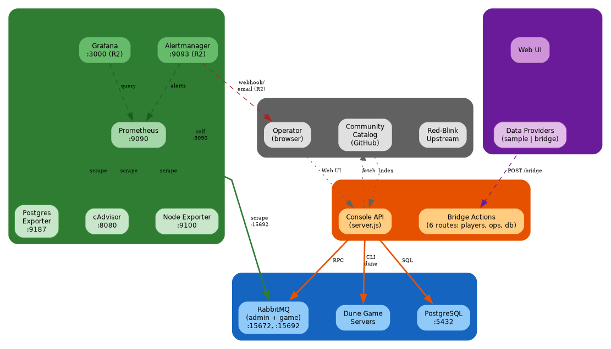
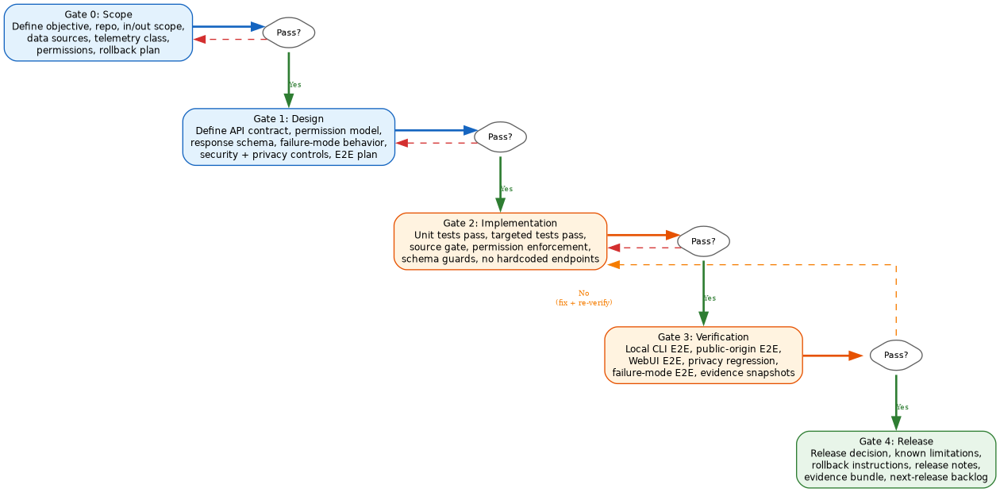
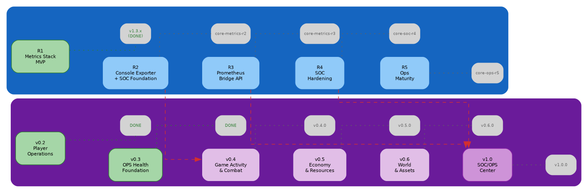

# RFC: Dune Ops Observability Comprehensive Roadmap and Release Cadence

**RFC ID**: RFC-DOO-0001
**Status**: Draft
**Date**: 2026-07-04
**Authors**: DarkDante (@yacketrj)
**Target**: `dune-ops-observability-addon` main, `dune-awakening-selfhost-docker` core R2–R5

---

## Abstract

This RFC defines the comprehensive roadmap, release cadence, and tagging convention for the Dune Ops Observability addon ecosystem. It establishes a 5-release Core infrastructure pipeline (R1 through R5) and a 6-release public addon train (v0.2 through v1.0) with explicit cross-track dependencies. The addon release plan is consolidated from 7 originally planned releases into 4: v0.4 (Game Activity & Combat), v0.5 (Economy & Resources), v0.6 (World & Assets), and v1.0 (SOC/OPS Operations Center). Each release is mapped to industry-standard metrics categories (RED, USE, Four Golden Signals, SOC2, DORA) and assigned a tagging convention covering 8 tag types across both repositories. This RFC does not change the existing v0.2–v0.3 releases, the R1 Metrics Stack, the 5-gate release standard, or the metric classification standard.

---

## 1. Terminology

| Term | Definition |
|---|---|
| **Core** | `dune-awakening-selfhost-docker` — the Red-Blink self-hosted Docker project providing infrastructure, Console API, addon bridge, and Prometheus stack |
| **Addon** | `dune-ops-observability-addon` — the community addon providing operator-facing panels, dashboards, and analytics UI via the Console iframe bridge |
| **Bridge action** | A permissioned POST endpoint at `/api/addons/installed/{id}/bridge` that routes addon requests to Backend data sources |
| **SOC** | Security Operations Center — monitoring focused on security posture, access control, auth failures, addon integrity |
| **OPS** | Operations — platform health, service lifecycle, data freshness, capacity and saturation |
| **P0/P1/P2** | Priority tiers: P0 = critical (impact to service), P1 = security-sensitive, P2 = operational analytics |
| **RED** | Rate, Errors, Duration — standard API-level monitoring metrics |
| **USE** | Utilization, Saturation, Errors — standard resource-level monitoring methodology |
| **SLO/SLI** | Service Level Objective / Service Level Indicator — quantified reliability targets |
| **DORA** | DevOps Research and Assessment — deployment frequency, lead time, MTTR, change failure rate |
| **Semver** | Semantic Versioning — MAJOR.MINOR.PATCH |

---

## 2. Motivation and Goals

### 2.1 Motivation

The Dune: Awakening self-hosted server currently provides an opt-in R1 Metrics Stack (Prometheus + 4 exporters + 16 alerts) and a community addon catalog with v0.3.0 OPS Health dashboards. However:

1. **No visualization layer** — Prometheus daa is queryable only via raw PromQL; no Grafana dashboards exist.
2. **No alerting pipeline** — 16 alert rules are defined but have nowhere to route; no Alertmanager is present.
3. **No game telemetry in metrics** — The `dune-stack.yml` rule group is empty; player activity, combat, economy, and resources are not observable via the metrics stack.
4. **No Prometheus bridge** — The addon cannot display Prometheus metrics (CPU, memory, saturation) because no permissioned bridge action exists.
5. **Rate limits are in-memory only** — Process restart clears all abuse buckets; no persistent storage.
6. **No proxy-aware IP detection** — Rate limiters key on raw socket address; `X-Forwarded-For` is not supported.
7. **No structured logging** — Server logs go to stdout with no log levels, aggregation, or rotation.

### 2.2 Goals

1. **Close all critical observability gaps** within 4 planned Core releases (R2–R5).
2. **Deliver industry-standard game telemetry** across 3 grouped addon releases (v0.4–v0.6).
3. **Graduate to SOC/OPS operations center** with v1.0 after Core R3+R4 are complete.
4. **Maintain formal governance** — all releases pass the existing 5-gate process, produce SOC2-style evidence, and include SBOM output.
5. **Keep the addon-first architecture** — Core provides infrastructure and bridge actions; the addon owns all user-facing panels.

---

## 3. Current Architecture

### 3.1 Core (R1 — deployed)



**Deployed infrastructure** (R1 Metrics Stack, per `R1-METRICS-STACK-IMPLEMENTATION-NOTES.md`):

| Component | Container | Port | Access |
|---|---|---|---|
| Prometheus | `dune-prometheus` | `127.0.0.1:9090` | Local only |
| cAdvisor | `dune-cadvisor` | 8080 | Internal network |
| Node Exporter | `dune-node-exporter` | 9100 | Internal network |
| Postgres Exporter | `dune-postgres-exporter` | 9187 | Internal network |
| RabbitMQ (scraped) | `dune-rmq-admin`, `dune-rmq-game` | 15692 | Internal network |

**Alert rule groups** (16 rules across 4 files):
- `host.yml` — 6 alerts: CPU >85%, Memory >90%, LowAvailableMemory <2GiB, Filesystem >85%/>95%, ReadOnly
- `containers.yml` — 4 alerts: ContainerMissing, HighMemory >90%, MemoryFailures, NetworkErrors
- `postgres.yml` — 6 alerts: PostgresDown, ScrapeError, HighConnections >80%/>95%, Deadlocks, LowCacheHit <95%
- `rabbitmq.yml` — 6 alerts: RabbitMQDown, HighMemory >80%, HighFileDescriptors >80%, QueueBacklog >1000, UnackedBacklog >1000, UnroutableMessages
- `dune-stack.yml` — Empty (reserved for R2)

**Bridge actions** (per `server.js:527-557`):

| Action | Permission | Data Source |
|---|---|---|
| `leadership.players.list` | `players:read` | PostgreSQL `player_state` |
| `ops.health.summary` | `ops:read` | Aggregate farm/player status |
| `ops.health.players` | `ops:read` | PostgreSQL player summary |
| `ops.health.farms` | `ops:read` | PostgreSQL farm aggregate |
| `ops.health.summary.v2` | `ops:read` | Combined aggregates |
| `database.query` | `database:read` | PostgreSQL (read-only SQL) |
| `database.execute` | `database:write` | PostgreSQL (auto-backup before write) |

**SOC controls**:
- HMAC-SHA256 session tokens (12h expiry + sliding extension)
- CSRF tokens on all mutating requests
- Login rate limiter: per-client (8 attempts/15m) + global aggregate (32 attempts/15m)
- Bridge rate limiter: per-addon (60/min) + global (300/min)
- `timingSafeEqual` constant-time password comparison
- Security headers: `nosniff`, `DENY` frame, restrictive `Permissions-Policy`
- JSONL audit logging to `runtime/generated/web-admin-audit.jsonl`
- Secret redaction (JWT, service auth, RabbitMQ secrets, Funcom tokens, passwords)
- Addon provenance tracking (SHA-256, install source, manifest URL)

### 3.2 Addon (v0.3.0 — released)

- **v0.2.x**: Player Operations — A3 Player Summary, A4 KPI Capability, A5 read-only KPI panels. Uses `players:read` permission with the `leadership.players.list` bridge action.
- **v0.3.0**: OPS Health Foundation — bridge freshness panel, source health labels, stale-data warnings (5-min threshold), in-session player-impact delta, operator status summary. Uses `ops:read` with no new bridge actions.
- Data providers: `sample` (direct browser preview, no Console dependency) and `bridge` (production iframe path via Console API).
- Release packaging: `scripts/package.sh` → `dist/dune-ops-observability-X.Y.Z.zip` → GitHub Release → SHA-256 verified → community catalog PR.

### 3.3 Release Governance (existing)

**5-gate release process** (per `release-standard.md`):
1. Gate 0 — Scope: objective, repo, in/out scope, data sources, permissions, rollback
2. Gate 1 — Design: API contract, permission model, response schema, failure-mode behavior
3. Gate 2 — Implementation: unit tests, targeted tests, permission enforcement, schema guards
4. Gate 3 — Verification: local CLI E2E, public-origin E2E, WebUI E2E, privacy regression
5. Gate 4 — Release: release decision, known limitations, rollback, release notes, evidence bundle



**Required evidence bundle** (16 files): release plan, scope, standards mapping, git state, changed files, unit test output, targeted test output, E2E local output, E2E public output, WebUI validation, privacy scan, failure mode output, known limitations, rollback, release decision.

**Non-negotiable security rules**: Never expose raw player rows, player IDs, account IDs, character names, Funcom/FLS identifiers, coordinates, exact positions, serialized blobs, SQL text, PromQL text, tokens, passwords, secrets, raw logs, unbounded high-cardinality labels.

---

## 4. Proposed Architecture

### 4.1 Core R2 — Console Exporter + SOC Foundation

**New containers**:
- `dune-grafana` — Grafana (:3000), always-on when addon is running, bind localhost
- `dune-alertmanager` — Alertmanager (:9093), routes to email and/or webhook (Discord/Slack)

**New metrics**:
- `dune-stack.yml` populated: Console API RED metrics (request rate, error count, latency p50/p95/p99), bridge action call rate, database query duration
- Console API exporter (new `/metrics` endpoint on the Console API port, Prometheus-scrapable)

**No new permissions or bridge actions**. R2 is purely infrastructure.

**New tags**: `core-metrics-r2`

### 4.2 Core R3 — Prometheus Bridge API

**New bridge action**:
- `metrics.query` — Accepts a safe PromQL subset (counters, gauges, rate, sum, avg over aggregates). Returns JSON. Requires `ops:read`. Validates no unbounded cardinality labels, no instant vectors with high cardinality, no raw metric names.

**New API endpoint**:
- `/api/server/metrics` — Returns host-level summary (CPU%, memory used/total/avail/%, disk used/total/free/%, uptime). Read from `/proc` and `statfs`. Already partially implemented for performance snapshot; expanded here.

**New infrastructure**:
- Structured logging: JSON Lines output with levels (debug, info, warn, error), timestamps, module tags, request IDs
- Log retention: 7-day rotation for server logs (configurable)

**No new permissions beyond existing `ops:read`**.

**New tags**: `core-metrics-r3`

### 4.3 Core R4 — SOC Hardening

**New container**:
- `dune-redis` — Redis (:6379), internal network only, used for persistent rate limit buckets

**SOC improvements**:
- Persistent rate limiting: both login and bridge rate limiters use Redis-backed sliding windows with configurable TTL. Survives process restart. Defaults: per-client 8/15m, global 32/15m (login); per-addon 60/min, global 300/min (bridge).
- Proxy-aware IP detection: reads `X-Forwarded-For` header with trusted proxy CIDR config (`ADMIN_TRUSTED_PROXIES`). Falls back to socket address if not behind trusted proxy.
- Per-addon CSP enforcement: each addon iframe gets a unique `Content-Security-Policy` computed from its declared permissions. Blocks addons from making outbound requests not declared in their CSP.
- Alertmanager receivers wired: email (SMTP config via env vars) and webhook (Discord/Slack URL via env vars). Alert annotations include runbook links.

**No new permissions**.

**New tags**: `core-soc-r4`

### 4.4 Core R5 — Ops Maturity

**New infrastructure**:
- Prometheus retention policy: configurable time-based retention with automated WAL backup
- Audit log rotation: compress and rotate `web-admin-audit.jsonl` on schedule (configurable)
- Health score aggregation: compute a single `dune_health_score` metric (0–100) weighted across host, container, postgres, rabbitmq components

**SLO/SLI framework**:
- Console API availability: target 99.5% uptime, measured via Prometheus `up` metric
- Bridge action latency: p95 < 5s, measured via R3 Console API exporter
- Data freshness: `ops.health.summary` < 5 min staleness, measured via bridge action timestamps

**DORA capability**:
- Deploy frequency and change lead time tracked via git tag timestamps
- MTTR tracked via incident event counter (manual operator annotation for now)

**No new permissions**.

**New tags**: `core-ops-r5`

### 4.5 Addon v0.4–v1.0

**v0.4.0 Game Activity & Combat** (merges v0.4 + v0.5):
- Player activity: active players by interval, online/offline transitions, session count/duration, last seen distribution, returning/new players, guild/faction activity
- Combat: player deaths by interval/location/cause, PvP vs PvE classification, NPC deaths, NPC types killed, death spike detection, top hostile NPCs
- **Requires**: database discovery phase complete; `ops:read` permission; Core R2 (Grafana + Alertmanager for operator visibility)

**v0.5.0 Economy & Resources** (merges v0.6 + v0.7):
- Resources: ore/spice sand/flour sand/fiber gathered, quantities by type and location, gathering spikes, scarcity indicators
- Economy: currency flow, solari balance movement, market transaction count, volume by item, average price, tax totals, wealth concentration, inflation indicators
- **Requires**: database discovery phase complete; `ops:read`; economy data classified as sensitive

**v0.6.0 World & Assets** (merges v0.8 + v0.9):
- Inventory/Crafting: crafted item counts, crafting failures, inventory movement, storage usage by category, container counts, storage pressure
- Location/Territory: active players by map/zone, death hot spots, gathering hot spots, NPC kill hot spots, base activity, territory pressure, activity heat map summaries
- **Requires**: database discovery phase complete; `ops:read`; location data classified as sensitive, coarse rollups only

**v1.0.0 SOC/OPS Operations Center**:
- Platform health: Console API uptime, bridge success/failure rate, API latency (from R3 exporter), database size and growth, database connection health
- Addon integrity: permission drift detection, manifest checksum drift, configuration drift
- Operability: degraded data sources, stale metrics warning, operator runbook links, incident notes
- **Requires**: Core R3 (`metrics.query` bridge), Core R4 (persistent rate limits + CSP)
- **Tags**: `v1.0.0`

---

## 5. Dependency Graph



```
Core R1 (done) ──► R2 (Grafana+Alertmanager) ──► R3 (bridge) ──► R4 (SOC) ──► R5 (maturity)
                       │                            │               │
                       ▼                            └──────┬────────┘
                  Addon v0.3 (done)                        ▼
                  Addon v0.4 (uses R2)                Addon v1.0.0 (needs R3+R4)
                  Addon v0.5 (DB discovery)
                  Addon v0.6 (DB discovery)
```

**Forward-compatibility notes**:
- v0.4–v0.6 do NOT depend on R3 or R4; they work with the existing R1 bridge actions plus new DB query results from discovery
- v1.0 requires both R3 and R4; cannot ship without `metrics.query` (no platform health data) and persistent rate limits + CSP (no SOC hardening)
- R5 is additive to v1.0; v1.0 can ship with R3+R4 only; R5 adds SLO/SLI scoring and DORA tracking

---

## 6. Tagging Convention

| Context | Prefix | Pattern | Example | Repository |
|---|---|---|---|---|
| Core feature merges | `core-{domain}-r{n}` | Release batch tag | `core-metrics-r2` | `dune-awakening-selfhost-docker` |
| Core feature branches | `feature/{area}` | Dev branch | `feature/console-exporter` | `dune-awakening-selfhost-docker` |
| Core upstream PRs | `pr/{n}` | Tracking ref | `pr/61` | `dune-awakening-selfhost-docker` (fork) |
| Addon releases | `v{major}.{minor}.{patch}` | Semver tag | `v0.4.0`, `v1.0.0` | `dune-ops-observability-addon` |
| Addon RCs | `v{major}.{minor}.{patch}-rc{n}` | Pre-release tag | `v0.4.0-rc1` | `dune-ops-observability-addon` |
| Addon features | `feature/{area}` | Dev branch | `feature/player-activity` | `dune-ops-observability-addon` |
| Evidence archive | `evidence/v{major}.{minor}.{patch}` | Evidence tag | `evidence/v0.4.0` | `dune-ops-observability-addon` |
| Immutable snapshots | `preserve/{desc}` | Restore point | `preserve/pre-db-discovery` | `dune-ops-observability-addon` |

**Tag creation workflow**:
1. All tests + security scans pass on the feature branch
2. Feature branch merged to `main`
3. Release evidence assembled (16-file bundle per `release-standard.md`)
4. Tag created: `git tag -a v0.4.0 -m "Dune Ops Observability v0.4.0 — Game Activity & Combat"`
5. Tag pushed: `git push origin --tags`
6. Package built, release created on GitHub, SHA-256 verified
7. Catalog manifest updated in `dune-docker-addons`, upstream PR submitted

**Semantic versioning rules** (per `RELEASE-CADENCE.md:26-31`):
- **PATCH** (v0.4.1): bug fix, package fix, manifest fix, documentation correction, safe UI correction
- **MINOR** (v0.5.0): new visible panel, read-only feature, operator workflow improvement
- **MAJOR** (v1.0.0): permission expansion, breaking manifest change, incompatible bridge contract

---

## 7. Security Considerations

### 7.1 Attack Surface Review

| Component | Current Exposure | R2–R5 Change | Mitigation |
|---|---|---|---|
| Prometheus | `127.0.0.1:9090` | No change | Localhost-only bind, no auth needed for local scrapes |
| Grafana (R2) | n/a | `127.0.0.1:3000` | Localhost-only, admin password auto-generated |
| Alertmanager (R2) | n/a | `127.0.0.1:9093` | Localhost-only; webhooks use TLS, email uses SMTP TLS |
| Redis (R4) | n/a | `dune-net:6379` | Internal Docker network only, no default password for trusted net, optional AUTH via env var |
| `metrics.query` bridge (R3) | n/a | `POST /api/addons/.../bridge` | Requires `ops:read`, validates PromQL safety (no unbounded cardinality, no raw metric names), rate-limited via bridge limiter |
| `X-Forwarded-For` (R4) | Not supported | Header parsed | `ADMIN_TRUSTED_PROXIES` CIDR config; falls back to socket address if not behind trusted proxy |

### 7.2 Data Exposure Risks

**New risk: Grafana access to Prometheus** — Grafana queries Prometheus directly. No new network exposure (both bind localhost). Grafana admin password is auto-generated to `runtime/secrets/grafana-admin-password.txt` on first run (same pattern as existing admin password generation).

**New risk: PromQL injection via bridge** — `metrics.query` action must sanitize PromQL input. The bridge will validate: no subqueries exceeding 1 level, no `topk`/`bottomk` without limit, no label_values/label_names calls, no regex matchers on high-cardinality labels, response size limited to `ADMIN_MAX_JSON_BYTES`. Rejects any query that returns raw metric names without aggregation.

**New risk: Redis data exposure** — Redis stores rate limit counters only (bucket counts, timestamps). No secrets, tokens, or PII. Internal Docker network only. Optional `requirepass` via env var for defense-in-depth.

### 7.3 Non-Negotiable Security Rules

These remain unchanged from `release-standard.md:176-193` and apply to all R2–R5 and v0.4–v1.0 work:

- Never expose raw player rows, player IDs, account IDs, character names, Funcom/FLS identifiers, actor IDs, coordinates, exact positions, raw serialized blobs, SQL text, PromQL text, tokens, passwords, secrets, raw logs by default, or unbounded high-cardinality labels.
- All new bridge actions require permission gating and rate limiting.
- All new API endpoints require CSRF validation for mutating requests.
- All new containers bind to localhost or internal Docker network by default.

---

## 8. Backwards Compatibility

### 8.1 Unchanged Interfaces

- Existing bridge actions (`leadership.players.list`, `ops.health.summary/v2/players/farms`, `database.query/execute`) remain unchanged in schema and behavior.
- Existing CLI commands (`dune status`, `dune ready`, `dune metrics *`) remain unchanged.
- Existing addon manifest schema remains unchanged.
- Existing versioning format (semver) and release cadence policy remain unchanged.

### 8.2 Additive Changes Only

- R2 adds new containers (Grafana, Alertmanager) but does not change existing ones.
- R3 adds new bridge action (`metrics.query`) but does not modify existing ones.
- R4 adds new container (Redis) and modifies rate limiter storage backend (in-memory → Redis) but keeps the same API and thresholds.
- R5 adds new metrics and SLO definitions but does not remove or break existing ones.

### 8.3 Breaking Changes (none planned)

No breaking changes are planned in R2–R5 or v0.4–v1.0. If a breaking change becomes necessary during implementation, it will be gated behind a MAJOR version bump per semver rules and documented in the release decision.

---

## 9. Implementation Plan

### 9.1 Sequence

```
Phase 1: Core R2 + Addon prep
  ├── R2: Grafana + Alertmanager + console exporter + dune-stack.yml
  └── Addon: Database discovery phase for v0.4

Phase 2: Addon v0.4 + Core R3
  ├── v0.4: Game Activity & Combat panels (uses R2 infrastructure)
  └── R3: Prometheus bridge API + structured logging

Phase 3: Addon v0.5 + Core R4
  ├── v0.5: Economy & Resources panels (DB discovery)
  └── R4: Redis rate limits + CSP + proxy-aware IP

Phase 4: Addon v0.6
  └── v0.6: World & Assets panels (DB discovery)

Phase 5: Addon v1.0 (requires R3+R4 complete)
  └── v1.0: SOC/OPS Operations Center

Phase 6: Core R5
  └── R5: SLO/SLI + retention + DORA tracking
```

### 9.2 Per-Release Checklist

Each release must complete the 5-gate process per `release-standard.md`. Minimum requirements:

1. Release plan written with classification (Upstream Core / Addon Product / Internal Tooling)
2. Design review with API contract, permission model, and failure-mode behavior
3. Implementation with unit tests, targeted tests, and security scans (Gitleaks, Semgrep, Trivy)
4. Verification with local CLI E2E, public-origin E2E, WebUI E2E, and privacy regression
5. Release with decision, known limitations, rollback instructions, release notes, and 16-file evidence bundle

### 9.3 Evidence and Documentation

Every release must produce:
- SBOM (CycloneDX or SPDX JSON) or documented no-change justification
- SOC2-style control evidence (change management, access control, testing, security review, risk review, data handling, rollback, audit trail)
- Updated documentation (README, affected docs, release notes, PR tracking)

---

## 10. Open Issues

1. **PostgreSQL direct access vs bridge-mediated queries** — v0.4–v0.6 require database queries for game telemetry. Should these queries be exposed through new bridge actions in Core, or should the addon query PostgreSQL directly via `database.query`? Current answer: use `database.query` for discovery; promote to dedicated bridge actions only for production dashboard paths.

2. **Grafana dashboard provisioning** — Should dashboards ship as JSON (provisioned at startup) or be user-built? Recommendation: ship 3 base dashboards (Host Overview, Dune Stack, API Health) as provisioned JSON; allow operators to create custom dashboards via Grafana UI.

3. **Alertmanager notification channels** — Email and webhook (Slack/Discord) are specified. Should SMS/PagerDuty be added as stretch goals? Defer to operator feedback after R2.

4. **Persistent audit log storage** — JSONL audit log currently grows unbounded. R5 adds rotation. Should historical audit logs be queryable through the addon (with `ops:read` permission)? Defer to v1.0+.

5. **Game telemetry retention** — Should the addon retain derived history (e.g., weekly player counts), or should it always query live data? Current policy: no retained history without design PR (hard line per SOC-OPS-ROADMAP.md).

6. **Core upstream PR scope** — Which R2–R5 components should be submitted upstream to Red-Blink? Upstream rule: only submit if generally useful, implementation-independent, narrow scope, and evidence-backed. R2 (Grafana+Alertmanager) and R3 (structured logging) are good upstream candidates. R4 (Redis + CSP) requires upstream discussion.

---

## 11. References

### Addon Repository
- [ROADMAP.md](ROADMAP.md) — Unified roadmap entry point
- [OBSERVABILITY-ROADMAP.md](OBSERVABILITY-ROADMAP.md) — Per-release candidate metrics, DB review requirements
- [SOC-OPS-ROADMAP.md](SOC-OPS-ROADMAP.md) — P0/P1/P2 metric taxonomy, release classification
- [RELEASE-CADENCE.md](RELEASE-CADENCE.md) — Versioning policy, cadence, upstream PR rules
- [BRANCHING.md](BRANCHING.md) — Branch naming conventions
- [WORKSTREAM-SPLIT.md](WORKSTREAM-SPLIT.md) — Repository boundary definition
- [DATA-PROVIDERS.md](DATA-PROVIDERS.md) — Bridge/sample provider abstraction
- [DATABASE-EVENT-INVENTORY.md](DATABASE-EVENT-INVENTORY.md) — PostgreSQL inventory procedure
- [METRIC-DISCOVERY-FINDINGS.md](METRIC-DISCOVERY-FINDINGS.md) — First discovery run findings
- [../ops-observability/roadmap/release-standard.md](../ops-observability/roadmap/release-standard.md) — 5-gate release process
- [../ops-observability/roadmap/metric-classification-standard.md](../ops-observability/roadmap/metric-classification-standard.md) — Metric classification rules

### Core Repository
- `docs/R1-METRICS-STACK-IMPLEMENTATION-NOTES.md` — R1 operational design and validation
- `docs/PR-EVIDENCE-ADDON-METRICS-SUPPORT.md` — Metrics stack PR scope, evidence
- `docs/E2E-METRICS-TESTING.md` — E2E test procedure
- `runtime/metrics/prometheus.yml` — Scrape configuration (6 jobs, 15s interval)
- `runtime/metrics/rules/` — 16 alert rules across 4 groups
- `console/api/src/server.js` — Bridge actions (addonBridgeRoute function)

### Community Catalog
- `dune-docker-addons/index.json` — Community addon index
- `dune-docker-addons/addons/dune-ops-observability.json` — Addon manifest v0.3.0

---

*This RFC is open for review. Comments and design feedback welcome via PR or issue on `yacketrj/dune-ops-observability-addon`.*
