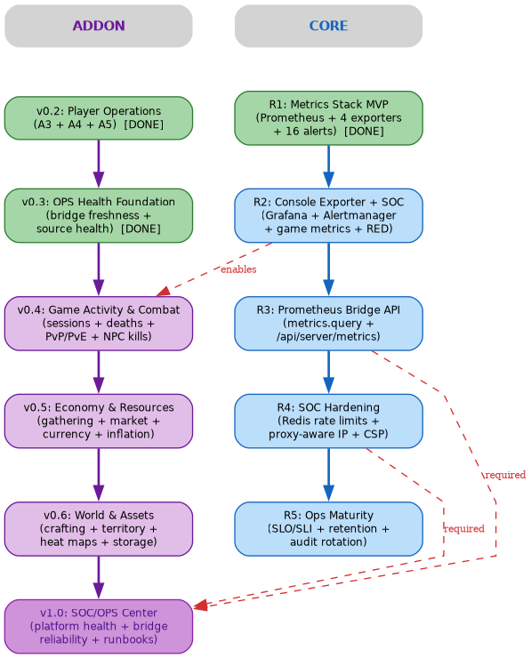

# Dune Ops Observability — Comprehensive Roadmap

**Status**: Draft v1.0
**Date**: 2026-07-04
**Repository**: `yacketrj/dune-ops-observability-addon`
**Canonical branch**: `main`

---

## 1. Overview

Dune Ops Observability is a publicly listed community addon for Red-Blink's Dune: Awakening self-hosted Docker server. It combines three tracks into a single operator-facing product:

1. **SOC/OPS monitoring** — platform health, service lifecycle, data freshness, capacity saturation, authentication posture.
2. **Game telemetry** — read-only aggregate analytics across players, combat, economy, resources, and world activity.
3. **Release governance** — formal 5-gate release process, SOC2-style audit evidence, SBOM generation, and metric classification before exposure.

The Core (`dune-awakening-selfhost-docker`) provides the infrastructure (Prometheus, exporters, HTTP API, addon bridge actions). The Addon (`dune-ops-observability-addon`) provides the operator-facing panels, dashboards, and analytics UI rendered inside the Dune Docker Console iframe.

This document is the single unified entry point. Detailed standards and per-release specifications are linked from Section 10.

---

## 2. Current Baseline

### Core (R1 Metrics Stack MVP — deployed)

| Component | Detail |
|---|---|
| Prometheus | `127.0.0.1:9090`, 6 scrape targets, 15s interval |
| Exporters | cAdvisor (:8080), Node (:9100), Postgres (:9187) |
| RabbitMQ scraping | admin :15692, game :15692 (built-in plugin) |
| Alert rules | 16 rules across 4 groups: host, containers, postgres, rabbitmq |
| CLI | `dune metrics start|stop|status|validate|logs` |
| Bridge actions | `leadership.players.list`, `ops.health.summary/v2/players/farms`, `database.query/execute` |
| SOC controls | HMAC sessions (12h + sliding), CSRF, login rate limit (per-client + global), bridge rate limit (per-addon: 60/min, global: 300/min), secret redaction, JSONL audit log, addon provenance tracking |
| CI | `api-tests`, `metrics-unit`, `security-checks` (gitleaks + trivy) — all green |

**Sources**: `R1-METRICS-STACK-IMPLEMENTATION-NOTES.md:11-96`, `server.js:527-557`, `ADDON-METRICS-SUPPORT:49-57`

### Addon (v0.3.0 released)

| Component | Detail |
|---|---|
| v0.2.x | A3 Player Summary, A4 KPI Capability, A5 read-only KPI panels (`players:read`) |
| v0.3.0 | OPS Health Foundation: bridge freshness, source health labels, stale-data warnings, operator status summary (`ops:read`) |
| Data providers | `sample` (direct browser preview), `bridge` (production iframe path) |
| Packaging | `scripts/package.sh` → zip → GitHub Release with SHA-256 |
| Release gates | `validate.js` (manifest + JS syntax), release asset checksum verifier |
| Catalog | `addons/dune-ops-observability.json` v0.3.0 in `dune-docker-addons`, PR open |

**Sources**: `OBSERVABILITY-ROADMAP.md:32-77`, `OPS-HEALTH-FOUNDATION.md`, `DATA-PROVIDERS.md`

---

## 3. Industry Standards Mapping

| Standard | Metrics | Current State | Target Release |
|---|---|---|---|
| **RED** (Rate/Error/Duration) | API request rate, error %, latency p50/p95/p99 | Not instrumented | Core R2 |
| **USE** (Utilization/Saturation/Errors) | CPU, memory, disk, network per resource | CPU + memory alerts exist (R1) | Core R2 (Grafana dashboards) |
| **Four Golden Signals** | Latency, traffic, errors, saturation | Partial (host + DB alerts only) | Core R3 (bridge queryable) |
| **SOC2 controls** | Change mgmt, access control, testing, risk review, audit trail | Partially done (5-gate release, PR evidence) | Core R4 + R5 |
| **DORA metrics** | Deploy frequency, lead time, MTTR, change fail % | Not tracked | Core R5 |
| **Game telemetry** | Session, progression, economy, combat, resources | Addon v0.4–v0.7 (DB-backed) | Addon v0.4–v0.7 |
| **SLO/SLI framework** | Error budget, availability target, health scoring | Not defined | Core R5 |

### AAA NOC Dashboard Metrics

Per AWS GameLift and industry-standard game server infrastructure monitoring, a production game NOC tracks:

| Category | AAA NOC Metrics | Dune Status | Target |
|---|---|---|---|
| **Server Health** | CPU util, CPU load (1/5/15m), memory %, disk %, network bytes/errors/dropped | Host alerts only (R1) | v0.4.0 NOC Dashboard |
| **Game Server Performance** | Tick time (p50/p90/p95), tick rate, connections, packets in/out, packet loss | Not tracked | v0.4.0 + Core R3 bridge |
| **Player Population** | CCU (concurrent users) over time, session count, session duration | Point-in-time only | v0.4.0 NOC Dashboard |
| **Service Lifecycle** | Up/down per service, restart count, crash count, health check status | `dune ready` only | v0.4.0 NOC Dashboard |
| **Database Health** | Connections, query latency, cache hits, deadlocks, DB size | Rules exist, no dashboard | v0.4.0 NOC Dashboard |
| **Message Queue** | Queue depth, message rate, unacked messages, unroutable count | Rules exist, no dashboard | v0.4.0 NOC Dashboard |
| **API Performance** | Request rate, error rate %, latency p50/p95/p99 per endpoint | Not instrumented | Core R2 → v0.4.0 |
| **Deployment Health** | Start time, uptime, crash count, restart trend | Not tracked | v0.4.0 NOC Dashboard |
| **Alert State** | Active alerts, firing count, silenced count, last notification time | 16 rules defined, no dashboard | Core R2 → v0.4.0 |
| **Service Dependencies** | Health map of all services, dependency chain status | Manual `dune status` only | v0.4.0 NOC Dashboard |

**Sources**: `AWS GameLift monitoring-overview`, `R1-METRICS-STACK-IMPLEMENTATION-NOTES.md:11-96`, `metric-classification-standard.md:1-11`, `REPOSITORY-REQUIREMENTS:307-328`

---

## 4. Release Table

### Core Releases

| Release | Name | Key Deliverables | New Permissions | Tags |
|---|---|---|---|---|
| **R1** | Metrics Stack MVP | Prometheus + 4 exporters, 16 alerts, CLI, SOC controls | — | `v1.3.x` (upstream) |
| **R2** | Console Exporter + SOC Foundation | Grafana (always-on), Alertmanager (email+webhook), `dune-stack.yml` populated, API RED metrics | — | `core-metrics-r2` |
| **R3** | Prometheus Bridge API | Permissioned `metrics.query` bridge action, `/api/server/metrics` endpoint, structured logging (jsonl+levels) | `ops:read` | `core-metrics-r3` |
| **R4** | SOC Hardening | Redis-backed persistent rate limits, proxy-aware IP (`X-Forwarded-For`), per-addon CSP sandbox, Alertmanager receiver wiring | — | `core-soc-r4` |
| **R5** | Ops Maturity | SLO/SLI framework, Prometheus retention/backup, audit log rotation/retention, health score aggregation | — | `core-ops-r5` |

**Sources**: `ADDON-METRICS-SUPPORT:49-57`, `dune-stack.yml:1-3`, `login-rate-limit-defense.md:1-25`

### Addon Releases

| Release | Name | Merges | Key Metrics | Permissions | Core Dep | Tags |
|---|---|---|---|---|---|---|
| **v0.2.0** | Player Operations | A3+A4+A5 | Player summary, KPI, capability | `players:read` | — | `v0.2.0` |
| **v0.3.0** | OPS Health Foundation | (released) | Bridge freshness, source health, operator status | `ops:read` | — | `v0.3.0` |
| **v0.4.0** | Player Activity & NOC Dashboard | v0.4+v0.5 | Sessions, transitions, retention, service health map, CCU tracking, resource snapshot, deployment health (combat deferred) | `ops:read` | R2 (enables) | `v0.4.0` |
| **v0.5.0** | Economy & Resources | v0.6+v0.7 | Ore/spice/fiber gathering, currency flow, market volume, inflation | `ops:read` (+ DB discovery) | — | `v0.5.0` |
| **v0.6.0** | World & Assets | v0.8+v0.9 | Crafting volumes, storage pressure, territory hot spots, activity heat maps | `ops:read` (+ DB discovery) | — | `v0.6.0` |
| **v0.6.1** | Refinery Crafting Calculator | — | Raw material requirements for spice, ore, and chemical refineries. Input desired output, see required inputs and ratios. Inspired by dune.gaming.tools/crafting-calculator. | `ops:read` | — | `v0.6.1` |
| **v0.7.0** | SOC/OPS Operations Center | (full platform) | Platform health, bridge reliability, addon drift, Prometheus metrics display, runbooks | `ops:read` | R3 + R4 | `v0.7.0` |

**Sources**: `OBSERVABILITY-ROADMAP.md:30-398`, `METRIC-DISCOVERY-FINDINGS.md:1-80`, `BRIDGE-ACTIONS.md`

---

## 5. Dependency Graph



```
Core R1 ──► R2 (Grafana+Alertmanager) ──► R3 (bridge) ──► R4 (SOC) ──► R5 (maturity)
(done)         │                            │               │
               ├───────────────────────────┐│               │
               ▼                           ▼▼               ▼
          v0.3 (done)                 v0.4 (activity+NOC) v0.7 (needs R3+R4)
          v0.4 (activity+NOC)         v0.5 (economy)
                                      v0.6 (world/assets)
```

**Key dependencies (red dashed lines)**:
- **R2 → v0.4**: Grafana + Alertmanager enable operator visibility into game telemetry and NOC dashboard
- **R3 → v0.7**: `metrics.query` bridge action allows v0.7 addon to display Prometheus data (CPU, memory, saturation, bridge reliability)
- **R4 → v0.7**: Persistent rate limits and per-addon CSP are required before v0.7 exposes SOC/OPS controls publicly

---

## 6. Database Discovery Phase

Before implementing any game-facing metric in v0.4–v0.6, a PostgreSQL event inventory must be run against the running `dune-postgres` container. This is a mandatory gate, not optional.

**Required output** (per `DATABASE-EVENT-INVENTORY.md`):
- Available schemas, tables, views, columns with types
- Candidate event/audit/activity tables
- Timestamp coverage and retention windows
- Estimated row counts
- Metric-source mapping: name → schema.table → columns → aggregation window → cardinality risk → privacy class

**Current discovery findings** (per `METRIC-DISCOVERY-FINDINGS.md`):
- Immediately available: player state (`playerconnectionstatus`, `characterstate`), farm state (total, ready, alive, connected players, S2S), inventory counts (79 items, 34 inventories), resource field state (27 entries), marker/location data (41 markers)
- Blocked (zero rows): `game_events`, `event_log`, `dune_exchange_orders`, `dune_exchange_fulfilled_orders`
- Approved safe aggregate candidates: player status summary (online/life/character counts), farm aggregate (total/ready/alive/S2S)

**Hard rule**: No economy, combat, death, NPC, resource, crafting, inventory, market, or location metric enters a release until its source table and columns are confirmed through a documented inventory.

**Sources**: `DATABASE-EVENT-INVENTORY.md:1-140`, `METRIC-DISCOVERY-FINDINGS.md:1-80`, `safe-query-candidates.sql`

---

## 7. Tagging Convention

| Context | Prefix | Pattern | Examples |
|---|---|---|---|
| Core feature merges | `core-{domain}-r{n}` | Release batch | `core-metrics-r2`, `core-soc-r4` |
| Addon releases | `v` (semver) | `v{major}.{minor}.{patch}` | `v0.4.0`, `v1.0.0` |
| Addon release candidates | `v` (semver-RC) | `v{major}.{minor}.{patch}-rc{n}` | `v0.4.0-rc1` |
| Addon feature branches | `feature/{area}` | Development branch | `feature/player-activity` |
| Evidence archive | `evidence/v{version}` | Release evidence | `evidence/v0.4.0` |
| Immutable snapshots | `preserve/{desc}` | Restore points | `preserve/pre-db-discovery` |
| Core upstream PRs | `pr/{n}` | PR tracking reference | `pr/61` |
| Core feature branches | `feature/{area}` | Core dev branch | `feature/console-exporter` |

**Sources**: `BRANCHING.md:1-17`, `RELEASE-CADENCE.md:24-29`, `PACKAGING.md`

### Tag Creation Flow

```
1. All tests + security scans pass on feature branch
2. Feature merged to main
3. Release evidence assembled (16-file bundle per release-standard.md)
4. git tag -a v{major}.{minor}.{patch} -m "Release description"
5. git push origin --tags
6. Package build → GitHub Release → SHA-256 verification
7. Catalog manifest updated → upstream PR submitted
```

---

## 8. Release Cadence

| Track | Cadence | Gate | Output |
|---|---|---|---|
| Addon internal PRs | ≤ daily (focused) | PR gates (16 checkpoints) | Feature branch merge |
| Addon public releases | ≤ every 2 weeks | 5-gate release process | GitHub Release + catalog PR |
| Core releases (fork) | Batched by capability block (R1→R5) | Core CI + e2e | Feature tag + upstream PR |
| Upstream Core PRs | After fork validation | Narrow scope, evidence-backed | Red-Blink upstream PR |
| Emergency patches | Allowed | Manifest, security review | Immediate release |

**Versioning** (semver):
- **PATCH**: bug fix, package fix, manifest fix, safe UI correction
- **MINOR**: new panel, read-only feature, operator workflow
- **MAJOR**: permission expansion, breaking manifest, incompatible bridge contract

**Sources**: `RELEASE-CADENCE.md:3-87`, `release-standard.md:13-191`

---

## 9. Decision Log

| Decision | Date | Rationale |
|---|---|---|
| v0.4-v0.7 grouped into 4 releases | 2026-07-04 | v0.4=activity+NOC (combat deferred), v0.5=economy+resources, v0.6=world+assets, v0.7=SOC/OPS. Reduces release count, avoids skipped version. |
| Grafana always-on when addon is running | 2026-07-04 | Operators need persistent access to platform metrics. Grafana binds localhost by default, same posture as Prometheus. |
| Alertmanager supports email + webhook | 2026-07-04 | Email for basic notification; webhook (Discord/Slack) for team ops. Either or both can be configured. |
| Redis acceptable for persistent rate limiting | 2026-07-04 | Redis is a small, well-understood container dependency. Acceptable trade-off for persistent rate limiting over in-memory-only. |
| v1.0.0 waits for Core R3+R4 | 2026-07-04 | v1.0 requires `metrics.query` bridge (R3) and persistent rate limits + CSP (R4). Cannot ship the Operations Center without these dependencies. |
| Addon remains addon-first | 2026-06-30 | Per RFC Addendum: addon owns UI, dashboards, analytics. Core owns bridge actions, infrastructure, upstream PRs. No observability features in Core Web UI. |
| PostgreSQL DB discovery mandatory before game metrics | 2026-07-02 | Per `DATABASE-EVENT-INVENTORY.md` hard rule: no metric enters a release until its source table/columns are confirmed through inventory. |
| Release evidence bundle required per release | 2026-06-30 | Per `release-standard.md`: 16-file evidence bundle, 5-gate process, SOC2-style controls, signed release decision. |

---

## 10. Document Index

### Roadmap & Planning
- **[OBSERVABILITY-ROADMAP.md](OBSERVABILITY-ROADMAP.md)** — Per-release candidate metrics and database review requirements for v0.4–v1.0
- **[SOC-OPS-ROADMAP.md](SOC-OPS-ROADMAP.md)** — P0/P1/P2 metric taxonomy, release classification (minor/major/patch), hard-line security rules
- **[METRICS-BRIDGE-ACTIONS.md](METRICS-BRIDGE-ACTIONS.md)** — Proposed bridge action names and required behavior

### Architecture & Design
- **[RFC-ADDENDUM-ADDON-FIRST-OBSERVABILITY.md](RFC-ADDENDUM-ADDON-FIRST-OBSERVABILITY.md)** — Architecture decision: addon-first observability
- **[WORKSTREAM-SPLIT.md](WORKSTREAM-SPLIT.md)** — Which work lives in addon repo vs Core repo
- **[DATA-PROVIDERS.md](DATA-PROVIDERS.md)** — Bridge/sample provider abstraction between UI and data sources
- **[OPS-HEALTH-FOUNDATION.md](OPS-HEALTH-FOUNDATION.md)** — v0.3.0 panel UX specification

### Design Review (2026-07-23)
- **[DESIGN-REVIEW-2026-07-23.md](DESIGN-REVIEW-2026-07-23.md)** — Full cross-tab design review, verified directly against current code (not the aspirational roadmap below) — start here before touching any tab.
- **[tabs/](tabs/)** — One verified architecture doc per tab (NOC-OVERVIEW, PLAYERS, ACTIVITY, COMBAT, SPICE-MELANGE, ECONOMY, INVENTORY, LOCATION, SOC).
- **[prompts/](prompts/)** — One Sonnet-5-consumable implementation prompt per tab, scoped to exactly what's real/buildable per the design review, plus **[prompts/PHASE-4-GOVERNANCE-AUTOMATION.md](prompts/PHASE-4-GOVERNANCE-AUTOMATION.md)** covering the gap analysis's final, still-open phase (README/version drift checks, release-tag ancestor guard).
- **[GAP-ANALYSIS-RESOLUTION-2026-07-23.md](GAP-ANALYSIS-RESOLUTION-2026-07-23.md)** — Resolution record for the separate 2026-07-22 security/architecture gap analysis (Phase 0–3, all merged; Phase 4 scoped via the prompt above, not yet executed).

### Data & Discovery
- **[DATABASE-EVENT-INVENTORY.md](DATABASE-EVENT-INVENTORY.md)** — PostgreSQL event inventory procedure (mandatory before game metrics)
- **[METRIC-DISCOVERY-FINDINGS.md](METRIC-DISCOVERY-FINDINGS.md)** — Results from first aggregate discovery run against `dune` database

### Governance & Standards
- **[release-standard.md](../ops-observability/roadmap/release-standard.md)** — 5-gate release process, evidence bundle, non-negotiable security rules
- **[metric-classification-standard.md](../ops-observability/roadmap/metric-classification-standard.md)** — Metric record schema, privacy classes, cardinality rules, DB/runtime/log query rules
- **[REPOSITORY-REQUIREMENTS-AND-DELIVERABLES.md](REPOSITORY-REQUIREMENTS-AND-DELIVERABLES.md)** — PR gates (16 checkpoints), release gates (12 items), SBOM, SOC2-style evidence, Definition of Done
- **[SECURITY-GATES.md](security/SECURITY-GATES.md)** — Addon validation gate requirements
- **[SHIFT-LEFT-SECURITY.md](security/SHIFT-LEFT-SECURITY.md)** — Local dev security toolchain (Gitleaks, Semgrep, Trivy)

### Release Operations
- **[RELEASE-CADENCE.md](RELEASE-CADENCE.md)** — Versioning policy, public release cadence, upstream catalog PR rules
- **[BRANCHING.md](BRANCHING.md)** — Branch naming conventions for addon and Core
- **[PACKAGING.md](PACKAGING.md)** — Package build, checksum verification, release workflow
- **[RELEASE-ASSET-CHECKSUM.md](RELEASE-ASSET-CHECKSUM.md)** — Release asset checksum verification for catalog submissions
- **[COMMUNITY-INDEX-PR.md](COMMUNITY-INDEX-PR.md)** — Upstream community catalog PR procedure

### Implementation Evidence
- **[R1-METRICS-STACK-IMPLEMENTATION-NOTES.md](../../../dune-awakening-selfhost-docker/docs/R1-METRICS-STACK-IMPLEMENTATION-NOTES.md)** (Core repo) — R1 operational design, security posture, validation evidence
- **[PR-EVIDENCE-ADDON-METRICS-SUPPORT.md](../../../dune-awakening-selfhost-docker/docs/PR-EVIDENCE-ADDON-METRICS-SUPPORT.md)** (Core repo) — Metrics stack PR scope, validation trail, E2E results
- **[E2E-METRICS-TESTING.md](../../../dune-awakening-selfhost-docker/docs/E2E-METRICS-TESTING.md)** (Core repo) — E2E testing procedure for the metrics stack

### Diagrams
- **[architecture.png](diagrams/architecture.png)** — Full system architecture (Core + Addon + External)
- **[dependencies.png](diagrams/dependencies.png)** — Core R1→R5 and Addon v0.2→v1.0 dependency graph
- **[gates.png](diagrams/gates.png)** — 5-gate release process flowchart
- **[timeline.png](diagrams/timeline.png)** — Release timeline with tags and cross-dependencies

---

*This document is maintained in sync with the operational roadmap. Last updated: 2026-07-04.*
